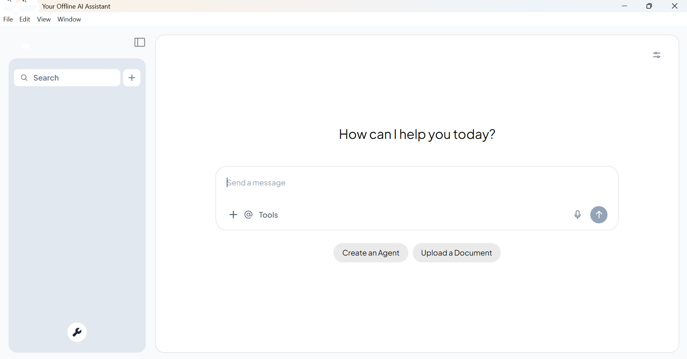
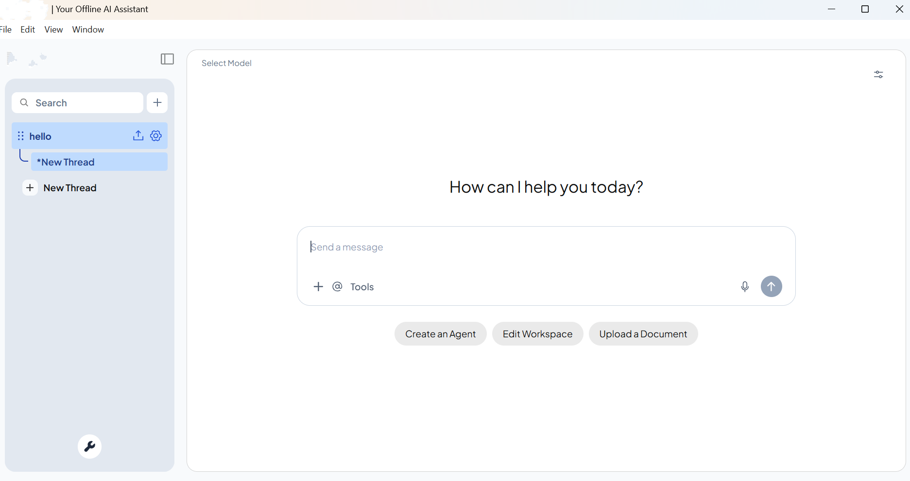
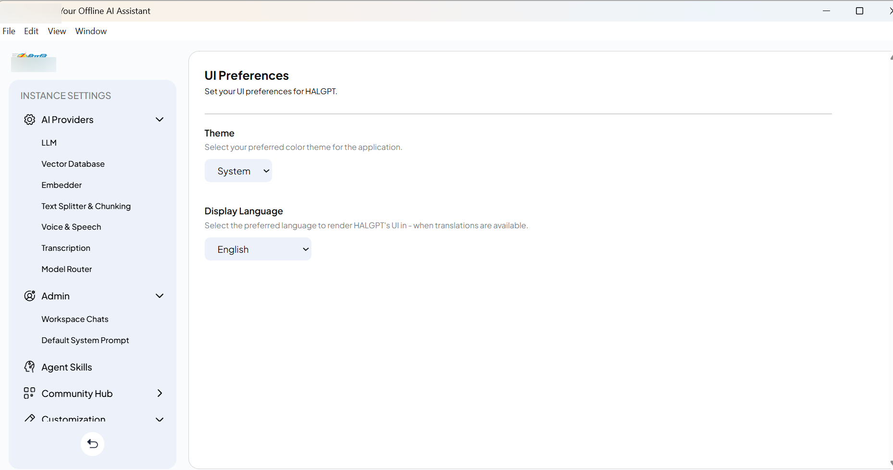

# HALGPT – Enterprise Offline AI Assistant Platform

> **Enterprise AI Assistant for Secure, Offline Document Intelligence**

> ⚠️ **Confidentiality Notice**
>
> This repository showcases the architecture, features, and technical contributions made during my internship at **Hindustan Aeronautics Limited (HAL)**.
>
> To respect confidentiality agreements, the proprietary source code, enterprise datasets, and internal implementation details are **not included**. This repository is intended to demonstrate the system design, workflow, technologies used, and my engineering contributions.


## 📖 Project Overview

HALGPT is an **Enterprise Offline AI Assistant Platform** designed for organizations operating in **secure and air-gapped environments** where internet access is restricted.

The platform enables users to upload enterprise documents, organize them into isolated workspaces, perform semantic document search, and interact with local Large Language Models (LLMs) to obtain accurate, context-aware responses.

Unlike traditional AI chatbots, HALGPT combines multiple AI capabilities into a single desktop application, including:

- 📄 Document Intelligence
- 🤖 Local Large Language Models
- 🔍 Semantic Search
- 🧠 Retrieval-Augmented Generation (RAG)
- 🎤 Speech Processing
- 🗂 Workspace Management
- ⚙️ Model Configuration
- 🔒 Secure Offline Deployment


# 📸 Application Screenshots

## Dashboard



## Workspace Management



## Settings




# ✨ Features

| Feature | Description |
|----------|-------------|
| 📂 Workspace Management | Organize documents into independent knowledge bases |

| 💬 AI Chat | Context-aware conversational interface |

| 📄 Document Upload | Upload PDF documents for analysis |

| 📌 Document Pinning | Attach documents to specific workspaces |

| 🔍 Semantic Search | Retrieve relevant document chunks using vector similarity |

| 🤖 Local LLM | Run language models completely offline using Ollama |

| 🧠 Retrieval-Augmented Generation | Ground responses using enterprise documents |

| 📚 Source Citation | Display retrieved document sources |

| 🗣 Speech Support | Text-to-Speech and Speech Processing |

| ⚙️ Model Management | Configure local models and inference settings |

| 🎨 UI Customization | Theme and language preferences |

| 🖥 Desktop Application | Electron-based Windows application |

| 🔒 Offline Deployment | No cloud dependency |

---

# 🏗 System Architecture

```
                     User
                       │
        ┌──────────────┴──────────────┐
        │                             │
        │       HALGPT Desktop        │
        │                             │
        └──────────────┬──────────────┘
                       │
        ┌──────────────┴──────────────┐
        │ Workspace Management        │
        │ Chat Interface              │
        │ Document Manager            │
        │ Settings                    │
        └──────────────┬──────────────┘
                       │
              Document Processing
                       │
              Text Chunk Generation
                       │
             Embedding Generation
                       │
             LanceDB Vector Store
                       │
            Semantic Similarity Search
                       │
             Retrieved Document Context
                       │
             Ollama Local LLM Engine
                       │
                AI Generated Response
```

---

# 🔄 Workflow

```
User Uploads Document
        │
        ▼
Document Parsing
        │
        ▼
Text Extraction
        │
        ▼
Text Chunking
        │
        ▼
Embedding Generation
        │
        ▼
Vector Storage (LanceDB)
        │
        ▼
User Asks Question
        │
        ▼
Similarity Search
        │
        ▼
Relevant Chunks Retrieved
        │
        ▼
Prompt Construction
        │
        ▼
Local LLM (Ollama)
        │
        ▼
Context-Aware Response
        │
        ▼
Source References Displayed
```

---

# 🛠 Technology Stack

| Layer | Technology |
|---------|------------|
| Frontend | React |
| Backend | Node.js |
| Desktop Application | Electron |
| Local LLM | Ollama |
| Language Model | TinyLlama |
| Vector Database | LanceDB |
| Retrieval | Retrieval-Augmented Generation (RAG) |
| Embeddings | Local Embedding Model |
| Language | JavaScript |
| Packaging | Electron Builder |

---

# 💼 My Contributions

During my internship at **Hindustan Aeronautics Limited (HAL)**, I contributed to the customization and deployment of the HALGPT platform by:

- Customized the application branding and user interface.
- Integrated local Large Language Models using Ollama.
- Configured LanceDB for semantic vector search.
- Improved the text chunking strategy to enhance retrieval accuracy.
- Removed cloud-dependent AI providers for complete offline deployment.
- Removed online vector database integrations.
- Removed online speech-to-text providers.
- Removed online text-to-speech providers.
- Removed cloud communication channels to support secure environments.
- Packaged the application into a Windows executable for enterprise deployment.
- Tested and validated the application in an offline environment.
- Created production-ready Windows executable packages using Electron Builder for offline enterprise deployment.

---

# 🚀 Key Capabilities

✅ Enterprise AI Assistant

✅ Offline Deployment

✅ Local LLM Inference

✅ Retrieval-Augmented Generation (RAG)

✅ Semantic Search

✅ Vector Database

✅ Workspace Isolation

✅ Source Citation

✅ Speech Processing

✅ Desktop Application

---

# 🎯 Challenges Addressed

- Building an AI assistant that operates completely offline.
- Improving document retrieval accuracy through optimized chunking.
- Eliminating dependencies on cloud-based AI services.
- Integrating local language models for secure environments.
- Managing isolated document workspaces efficiently.
- Packaging the application for Windows deployment.

---

# 📚 Key Learnings

Through this project, I gained practical experience in:

- Retrieval-Augmented Generation (RAG)
- Large Language Models (LLMs)
- Semantic Search
- Vector Databases
- Enterprise AI Systems
- Local AI Deployment
- Electron Desktop Development
- AI System Integration
- Document Intelligence
- Offline AI Architectures

---


# 📄 Confidentiality

This repository intentionally excludes proprietary source code, enterprise datasets, internal documentation, and confidential implementation details.

The content presented here is intended solely to demonstrate the architecture, workflow, technologies, and engineering concepts explored during the internship while fully respecting the confidentiality obligations of Hindustan Aeronautics Limited (HAL).

---

